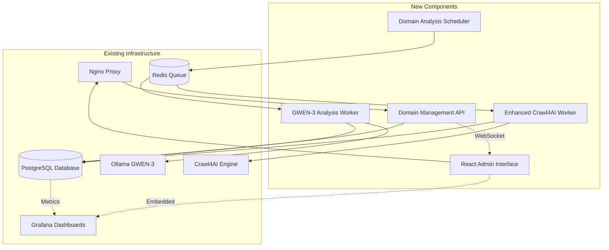

# Component Architecture

## New Components

### **GWEN3AnalysisWorker**
**Responsibility:** Daily domain structure analysis using GWEN-3 8B model để generate parsing templates
**Integration Points:** Redis queue consumption, PostgreSQL template storage, Ollama GWEN-3 API calls

**Key Interfaces:**
- Redis queue listener cho scheduled domain analysis jobs
- Ollama GWEN-3 API client cho page structure analysis
- PostgreSQL connection cho template storage và domain status updates
- Prometheus metrics emission cho analysis performance tracking

**Dependencies:**
- **Existing Components:** Redis queue system, PostgreSQL database, Ollama service, monitoring infrastructure
- **New Components:** DomainConfigurationService for domain metadata access

**Technology Stack:** Python 3.11+, asyncio workers, Ollama client SDK, SQLAlchemy ORM, structured logging

### **DomainManagementAPI**
**Responsibility:** RESTful API backend cho React admin interface domain CRUD operations
**Integration Points:** PostgreSQL domain data access, authentication middleware, real-time WebSocket updates

**Key Interfaces:**
- FastAPI REST endpoints cho domain configuration management
- WebSocket connections cho real-time analysis status updates
- Authentication integration với existing security middleware
- Database connection pooling với existing PostgreSQL patterns

**Dependencies:**
- **Existing Components:** PostgreSQL database, Redis cache, authentication system, monitoring metrics
- **New Components:** ReactAdminInterface (consumer), GWEN3AnalysisWorker (coordination)

**Technology Stack:** FastAPI framework, SQLAlchemy ORM, WebSocket support, existing authentication middleware

### **ReactAdminInterface**
**Responsibility:** Professional web interface cho managing 200+ domains và monitoring analysis status
**Integration Points:** DomainManagementAPI consumption, existing Grafana dashboard embedding

**Key Interfaces:**
- REST API calls to DomainManagementAPI cho domain operations
- WebSocket connections cho real-time status updates
- Embedded Grafana dashboards cho domain performance metrics
- Nginx reverse proxy routing integration

**Dependencies:**
- **Existing Components:** Nginx reverse proxy, authentication system, Grafana monitoring
- **New Components:** DomainManagementAPI (backend), real-time notification system

**Technology Stack:** React 18+, TypeScript, Material-UI components, WebSocket client, axios HTTP client

### **EnhancedCrawl4AIWorker**
**Responsibility:** Template-based content extraction using GWEN-3 generated parsing rules
**Integration Points:** Template lookup từ database, existing Crawl4AI engine, fallback mechanisms

**Key Interfaces:**
- Database template lookup cho domain-specific parsing rules
- Crawl4AI engine integration với template-guided extraction
- Redis queue coordination với existing crawler workers
- Existing NewsArticle storage patterns maintained

**Dependencies:**
- **Existing Components:** Crawl4AI engine, PostgreSQL database, Redis queue, MinIO storage
- **New Components:** DomainParsingTemplate lookup service, GWEN3AnalysisWorker (template source)

**Technology Stack:** Python 3.11+, enhanced Crawl4AI integration, template processing logic, existing storage patterns

### **DomainAnalysisScheduler**
**Responsibility:** Intelligent scheduling của GWEN-3 analysis jobs cho 200+ domains distributed throughout day
**Integration Points:** Domain configuration monitoring, Redis queue job creation, analysis load balancing

**Key Interfaces:**
- Cron-based scheduling với domain priority management
- Redis queue job placement với staggered timing (8-10 domains/hour)
- Domain configuration change detection cho triggered re-analysis
- Analysis performance monitoring và queue optimization

**Dependencies:**
- **Existing Components:** Redis queue system, PostgreSQL database, monitoring metrics
- **New Components:** GWEN3AnalysisWorker (job consumer), domain configuration management

**Technology Stack:** Python scheduler, Redis queue management, PostgreSQL queries, performance optimization logic

## Component Interaction Diagram

---
